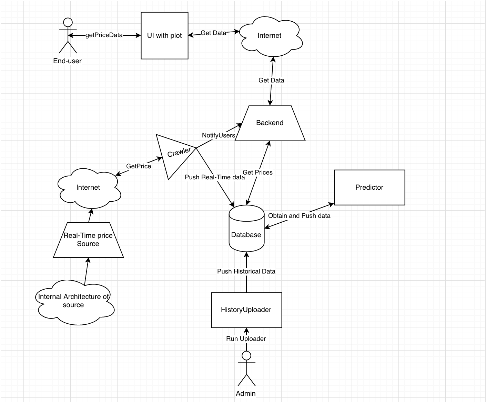

# '2ez' Project requirements

## Table of contents

* [Goals](#goals)
* [Project objectives](#project-objectives)
* [Business requirements](#business-requirements)
* [Functional requirements](#functional-requirements)
* [Non-Functional requirements](#non-functional-requirements)
* [Architecture and technical details](#architecture-and-technical-details)

## Goals

 1. To develop the stable software for Brent Oil price prediction

## Project objectives

 1. Requirements for software are analyzed and documented in Software Requirements specification here it's Project reqirements
 2. Minimum viable product is developed
 3. Software is tested
 4. Desirable improvements integrated and tested

## Business requirements

* Software must have UI
* Software must display historical, current and predicted prices
* Predictions should be accurate

## Functional requirements

 1. High-level system overview:
 
 2. Requirements for UI:
    * graphical representation of historical price data in user-defined date scope as plot
    * predicted prices in user-defined date scope in plot
    * real-time price ticker on-demand in plot
    * greetings page explining project goals and navigation bar through all content
 3. Data collection requirements:
    * Historical data collected once by historyuploader which runs by admin before starting site
    * real-time data collects as fast as it can be updated in source
 4. Prediction requirements:
    * TODO
 5. Error handling:
    * Scope sent to backend is checked for boundaries and after returned to user as filled JSON file to show the plot
    * If requested scope has 0 data when 0 data is shown

## Non-Functional requirements

 1. Project must be able to train at least for 20 seconds and accurate(at least 75% for prediction)
 2. UI must be convenient for end-user
 3. Data can be obtained from different sources
    * [X-markets](https://www.xmarkets.db.com/DE/ENG/Underlying-Detail/XC0009677409)
    * [Intrinio](https://intrinio.com/)
    * etc...
 4. Real-time data with once a second frequency
 5. Project supports only desktop browsers
 6. Project must be available 90% of the time
 7. Project must be available for at least 3 end-users, while it ran on a single machine

## Architecture and technical details

 1. Project must maintain [WebSocket](https://www.websocket.org/) technology for permanent connection and displaying real-time prices
 2. Project must store historical and real-time data in database(current is [MySQL](https://www.mysql.com/))
 3. Architecture of database suggests composite unique key containing timestamp and source of data for each entry stored in one table
 4. Ability to predict Brent oil prices with machine learning algorithms(Self-written algorithms and libraries for example [Spark MLLib](https://spark.apache.org/docs/latest/index.html))
 5. REST API
 6. Historical data obtained before server is started for performance purposes using separate [tool](https://github.com/vladdord/HistoryUploader) which currently in another repository